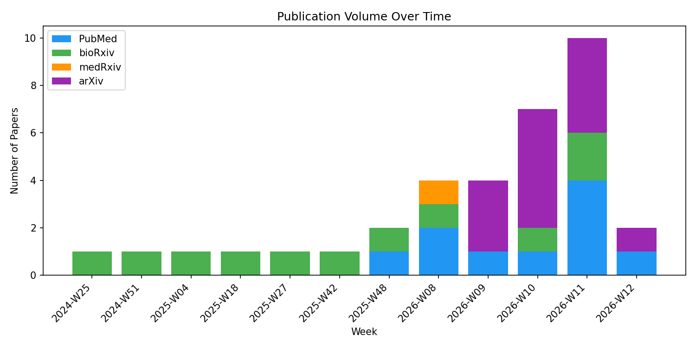
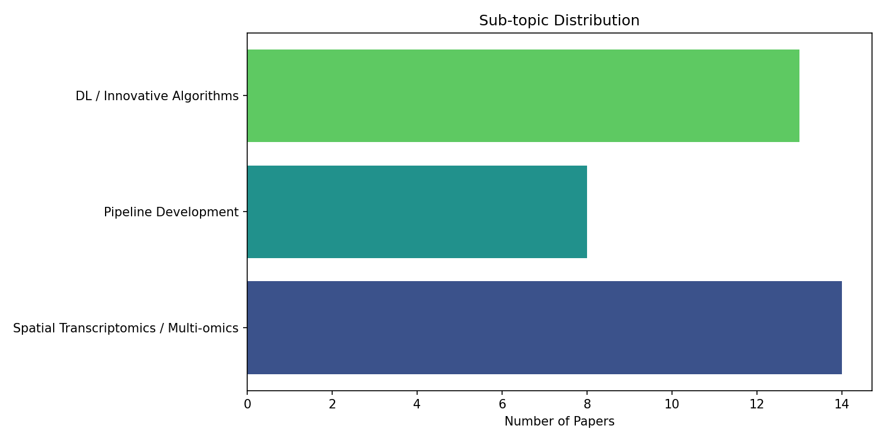
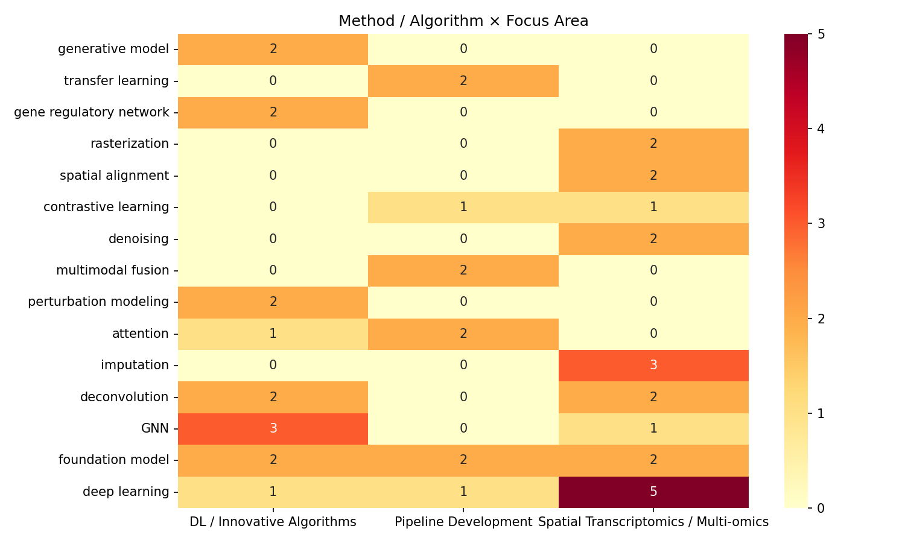
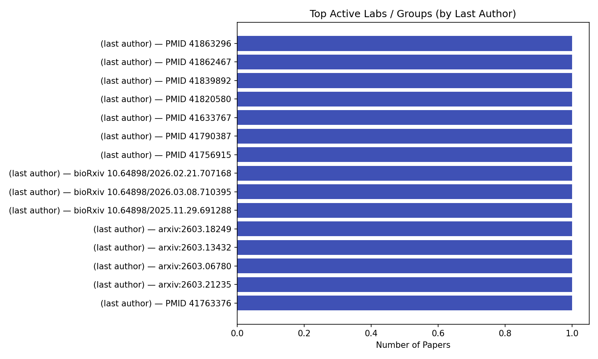
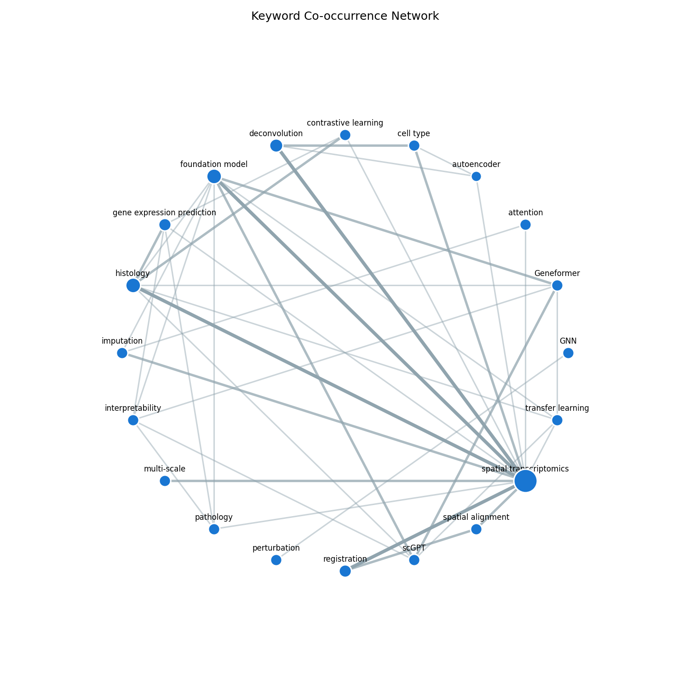

# Literature Trend Debrief — 2026-03-23

**Reports analyzed:** 1 search report covering 35 papers
**Date range:** 2024-06-28 — 2026-03-23
**Focus areas:** spatial transcriptomics / multi-omics, pipeline development, DL / innovative algorithms in sequencing

---

## Executive Summary

The spatial transcriptomics and deep learning landscape in early 2026 is dominated by three converging trends: histology-to-gene-expression prediction, foundation model adaptation, and spatial perturbation modeling. Histology-based expression prediction has become a crowded subfield, with at least seven methods (HINGE, CPNN, BiTro, MViTGene, MAD, MINT, Pixel2Gene) each offering different architectural strategies ranging from vision transformers to knowledge distillation. Foundation models are rapidly entering the spatial domain — spRefine uses genomic language models for ST denoising, HINGE adapts scGPT/Geneformer to spatial context, MINT uses ST data to supervise pathology foundation model training, and "ST as Images" enables image-based self-supervised pretraining on ST data. Spatial deconvolution remains a highly active area with four new methods (SA2E, UCASpatial, ZI-HGT + CARD, Count Bridges), each exploring distinct architectural strategies including spatial-aware autoencoders, ultra-precision frameworks, zero-inflated models, and bridge processes. A genuinely novel capability emerges with stVCR (Nature Methods), which models spatiotemporal single-cell dynamics from time-series ST, and with Celcomen and TRAILBLAZER, which enable causal and generative perturbation modeling in spatial contexts. Graph-based architectures (GNNs, graph transformers, graph diffusion) are pervasive across all focus areas. The field is transitioning from pure method development toward clinically deployable pipelines, as evidenced by SpaCRD (cancer detection), MAD (histology-only inference), and multi-platform validation (Pixel2Gene across Visium HD, Xenium, CosMx). Spatial alignment and registration (RAFT-UP, GALA, Domain Elastic Transform) are receiving increased attention, reflecting the practical needs of multi-section 3D reconstruction workflows.

---

## Emerging Topics

### New Methods & Tools
- **Spatiotemporal ST modeling** — stVCR (Nature Methods) is the first method to infer cell velocity, trajectory, and fate from time-series spatial transcriptomics, filling a gap between RNA velocity and spatially resolved measurements.
- **Foundation model adaptation for spatial data** — HINGE adapts scGPT/Geneformer to predict spatial gene expression from histology; MINT uses ST as molecular supervision for pathology foundation model training; "ST as Images" enables image SSL pretraining on rasterized ST data.
- **Causal perturbation modeling** — Celcomen (generative GNN with causal disentanglement) and TRAILBLAZER (multicellular transformer with zero-shot prediction) represent a new paradigm of predictive spatial biology beyond purely observational analysis.
- **Knowledge distillation for clinical deployment** — MAD introduces teacher-student distillation for virtual spatial omics, enabling histology-only inference at reduced compute cost.
- **Frequency-domain analysis** — SpatioFreq brings a novel frequency-domain perspective to ST, decomposing expression signals into multi-scale frequency components.
- **GNN + KAN hybrid** — An integrated deep learning framework combining graph neural networks with Kolmogorov-Arnold Networks and MixUp augmentation for explainable RNA-seq classification (medRxiv).
- **Sparse autoencoders for FM interpretability** — Probing the internal representations of scGPT, scFoundation, and Geneformer through sparse autoencoders.

### New Datasets & Benchmarks
- **Multi-platform ST benchmarking** — Pixel2Gene validated across Visium HD, Xenium, and CosMx, establishing cross-platform performance baselines.
- **Organoid Stereo-seq profiling** — ST Benchmarking Across Organoids provides Stereo-seq profiles across multiple organoid models.
- **Immune heterogeneity benchmarks** — UCASpatial introduces focused benchmarking on immune cell subtypes for deconvolution evaluation.

---

## Quantitative Trends

### Publication Volume

| Source | Count |
|--------|-------|
| PubMed | 8 |
| bioRxiv | 10 |
| arXiv | 13 |
| medRxiv | 1 |
| **Total** | **35** |

Publication activity peaked in March 2026, with arXiv and bioRxiv together accounting for 66% of papers. PubMed-indexed papers include high-impact venues (Nature Methods, Nature Communications, Genome Research).

### Sub-topic Distribution

| Focus Area | Count |
|------------|-------|
| Spatial Transcriptomics / Multi-omics | 14 |
| DL / Innovative Algorithms | 13 |
| Pipeline Development | 8 |

Spatial transcriptomics / multi-omics leads in volume, but DL / innovative algorithms is nearly tied, reflecting the computational methods community's growing engagement with spatial data.

### Method / Algorithm Landscape

The most frequently cited method categories across all papers are: deep learning (general), foundation models, GNNs/graph methods, contrastive learning, autoencoders, deconvolution algorithms, and transformers. Foundation models appear across all three focus areas, confirming their cross-cutting role. Graph-based methods (GNN, graph transformer, graph diffusion) appear in at least 6 papers.

### Most Active Labs & Groups

Author attribution is limited in this report (PMIDs and DOIs provided rather than full author lists). Labs publishing in Nature Methods (stVCR) and Nature Communications (FineST, UCASpatial, Celcomen) represent the most impactful groups in this collection.

### Keyword Co-occurrence

The keyword network reveals strong co-occurrence clusters around: (1) "spatial transcriptomics" + "deconvolution" + "cell type"; (2) "foundation model" + "histology" + "gene expression prediction"; (3) "GNN" + "perturbation" + "causal inference". The term "spatial transcriptomics" serves as the central hub connecting all clusters.

---

## Synthesis

### Converging Findings
- **Spatial context consistently improves model performance.** Methods that incorporate spatial neighborhood information (SA2E, SpatialMAGIC, SpatioFreq, Celcomen) consistently outperform non-spatial baselines, regardless of the downstream task.
- **Multimodal fusion of histology and ST outperforms unimodal approaches.** This is confirmed independently by SpaCRD (cancer detection), FineST (ligand-receptor analysis), Pixel2Gene (expression prediction), and MViTGene.
- **Foundation model features transfer effectively to spatial tasks.** HINGE demonstrates that scGPT/Geneformer representations improve spatial expression prediction; spRefine shows genomic language models improve ST denoising; MINT shows ST supervision improves pathology models.

### Literature Gaps
- **Temporal + spatial methods are underrepresented.** stVCR is the only method addressing time-series ST; the field needs more tools for dynamic spatial analysis.
- **Sub-cellular resolution methods are limited.** Most methods target Visium-scale resolution; few specifically address the unique challenges of Xenium, MERFISH, or CosMx at sub-cellular scale.
- **Clinical validation is scarce.** Despite growing clinical motivation (SpaCRD, UCASpatial for immunotherapy), most methods lack prospective clinical validation.
- **Reproducibility infrastructure.** No papers in this collection provide standardized benchmarking pipelines or shared evaluation frameworks beyond individual method comparisons.
- **3D spatial transcriptomics.** Despite interest in alignment (RAFT-UP, GALA, Domain Elastic Transform), end-to-end 3D ST reconstruction and analysis pipelines remain underdeveloped.

### Field Direction
The field is moving in three clear directions: (1) from method development to clinical deployment, with knowledge distillation (MAD) and multi-platform validation (Pixel2Gene) reducing barriers to real-world use; (2) from static snapshots to dynamic and causal modeling, with stVCR (temporal), Celcomen (causal), and TRAILBLAZER (perturbation) pushing beyond descriptive analysis; (3) from task-specific models to foundation models, with at least five papers directly engaging with pre-trained large models. We expect the next 6-12 months to bring consolidation in the histology-to-expression prediction subfield, wider adoption of foundation model adaptation strategies, and the emergence of standardized benchmarking efforts.

### Contradictions & Debates
- **Deconvolution architecture:** SA2E (spatial autoencoder), UCASpatial (ultra-precision framework), ZI-HGT + CARD (zero-inflated model), and Count Bridges (bridge process) propose fundamentally different architectures for the same task, with no consensus on which inductive bias is optimal.
- **Foundation model adaptation vs. training from scratch:** HINGE demonstrates that adapting existing foundation models outperforms training from scratch, while MINT argues for training foundation models with molecular supervision from the ground up. The optimal strategy likely depends on available paired data and compute budget.
- **Spatial imputation approaches:** spRefine (language model), SpatialMAGIC (graph diffusion), and Pixel2Gene (histology-guided) represent three competing paradigms for ST imputation, each with different data requirements and assumptions.
- **Interpretability vs. performance:** The sparse autoencoder interpretability work (bioRxiv) and "Beyond Attention Heatmaps" paper suggest growing concern that foundation model and MIL-based approaches trade interpretability for performance, a tension the field has not resolved.
